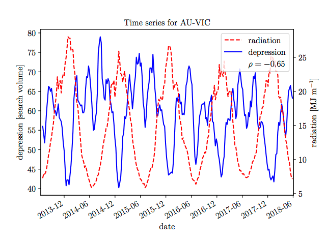

# google_trends_project
# Resolved a merge conflict - testing commit and push
Quick and dirty code for downloading Google trends data for a given key word and Australian state, and correlating it with Bureau of Meteorology capital city weather station data.   

